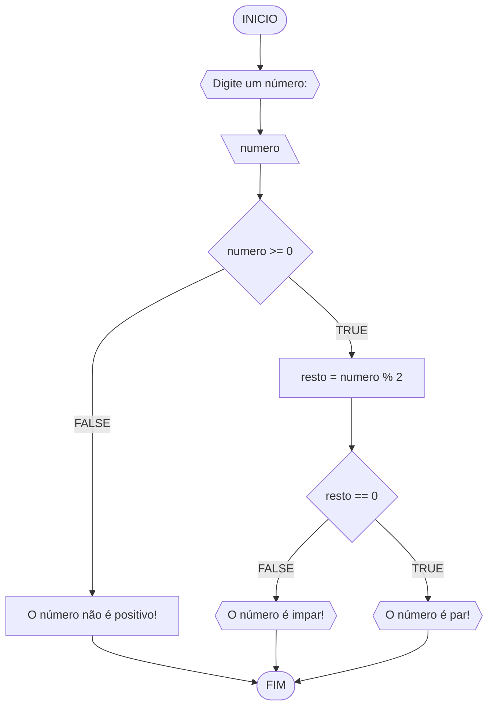
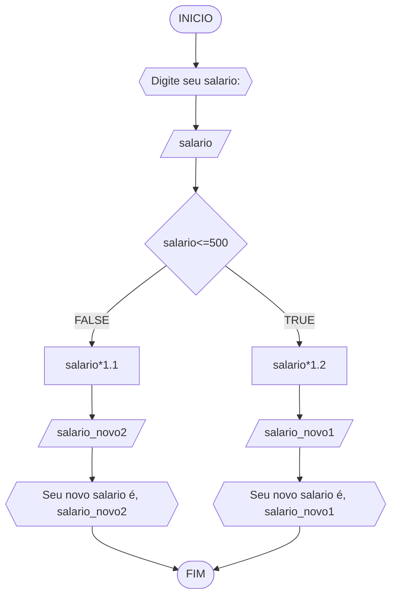
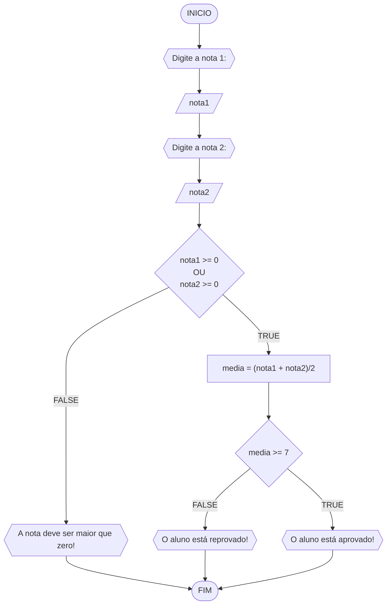
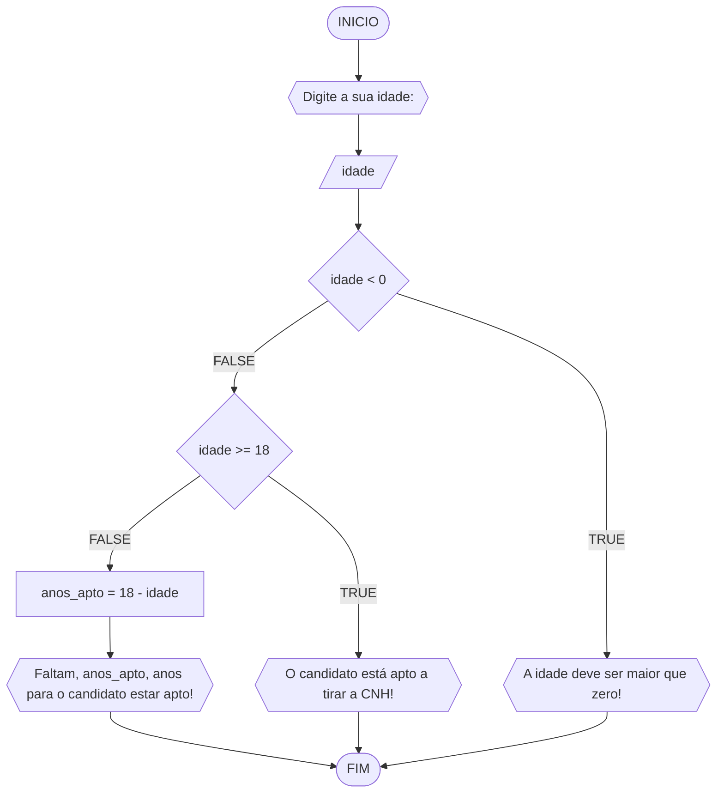

# UNIFOR
**Nome**: Diogo Oliveira Paiva do Nascimento <br>
**Disciplina**: Raciocínio lógico algorítmico

## Lista de exercícios 01

### Exercício 01 (1 ponto)
Represente, em fluxograma e pseudocódigo, um algoritmo para determinar se um número inteiro e positivo é par ou impar.

#### Fluxograma (0,25 ponto)



#### Pseudocódigo (0,5 ponto)
```
1  ALGORTIMO verifica_par_impar
2  DECLARE numero, resto: INTEIRO
3  ESCREVA "Digite um número: "
4  INICIO
4  LEIA numero
5  SE numero >= 0 ENTAO                  // verifica se o inteiro é positivo
6    resto = numero % 2                 // calcula o resto da divisão por 2
7    SE resto == 0 ENTAO                // verifica se o resto é igual a zero
8      ESCREVA "O número é par!"
9    SENAO
10     ESCREVA "O número é impar!"
11   FIM_SE
11  SENAO                                // caso inteiro for negativo (condição linha 5)
12    ESCREVA "O número deve ser postivo!"
13  FIM_SE
13 FIM
```

#### Teste de mesa (0,25 ponto)
| numero | numero >= 0 | resto | resto == 0 | Saída |
| -- | -- | -- | -- | -- | 
| -1 | F |   |   | "O número deve ser postivo!" |
| 0  | V | 0 | V | "O número é par!" |
| 13 | V | 1 | F | "O número é impar!" |
| 30 | V | 0 | V | "O número é par!" |

## Exercício 02 (3 pontos)
Represente, em fluxograma e pseudocódigo, um algoritmo para calcular o novo salário de um funcionário. 
Sabe-se que os funcionários que recebem atualmente salário de até R$ 500 terão aumento de 20%; os demais terão aumento de 10%.

#### Fluxograma (1.0 ponto)



#### Pseudocódigo (1.0 ponto)

```
Algoritmo ContaAprovacoes
1  DECLARE salario, salario_novo1, salario_novo2
2  INICIO
3  ESCREVA "Digite seu atual salario:"       //Solicitar ao usuario qual o salario dele 
4  LEIA salario     //Armezenar a resposta em forma de variavel "salario"
5  SE salario <=500      //Decicir se o salario é menor ou igual a 500, para poder decidir a proxima ação 
6    salario_novo1 -> salario * 1.2        //Atualizar o salario caso seja menor ou igual a 500
7    ESCREVA "Seu novo salario é:", salario_novo1     //Falar para o usuario qual seu novo salario 
8  SENÃO
9    salario_novo2 -> salario * 1.1    //Atualizar o salario caso seja maior de 500
10    ESCREVA "Seu novo salario  é:", salario_novo2     //Falar para o usuario qual seu novo salario 
11  FIM_SE
FIM_ALGORITMO
```

#### Teste de mesa (1.0 ponto)

|    Salario   |    Aumento   | Salario Novo |
|      --      |      --      |      --      |
|     750      |      10%     |      825     |
|     450      |      20%     |      540     |

## Exercício 03 (3 pontos)
Represente, em fluxograma e pseudocódigo, um algoritmo para calcular a média aritmética entre duas notas de um aluno e mostrar sua situação, que pode ser aprovado ou reprovado.

#### Fluxograma (1 ponto)



#### Pseudocódigo (1 ponto)

```
Algoritmo ContaAprovacoes
DECLARE nota1, nota2, media: REAL
INICIO
    ESCREVA "Digite a nota 1:"        //Perguntar ao usuario qual a nota 1 
    LEIA nota1     //Armazenar no sistema a nota 1
    ESCREVA "Digite a nota 2:"           //Solicitar ao usuario qual a nota 2
    LEIA nota2        //Armazenar no sistema a nota 2
    SE nota1 >= 0 E nota2 >= 0 ENTAO       //Decidir se a notas são positivas ou não 
        media ->  (nota1 + nota2)/2        //Atribuir a variavel media para a equação (nota1 + nota2) / 2
        SE media >= 7 ENTAO               //Tomar decisão se a media for maior que 7
            ESCREVA "O aluno está aprovado!" //Falar para o usuario que ele esta aprovado 
        SENAO
            "O aluno está reprovado!"          //Falar para o aluno que ele esta reprovado 
        FIM_SE
    SENAO
        ESCREVA "A nota deve ser maior que zero!"   //Caso o usuario escreva uma nota negativa, essa mensagem sera emcaminhada para ele 
    FIM_SE
FIM
```

#### Teste de mesa (1 ponto)

|    Idade     | Pode tirar ? | Faltam quantos anos? |
|      --      |      --      |         --           | 
|      15      |     não      |          3           |  
|      25      |     sim      |          -           | 

## Exercício 04 (3 pontos)
Represente, em fluxograma e pseudocódigo, um algoritmo que, a partir da idade do candidato(a), determinar se pode ou não tirar a CNH. 
Caso não atender a restrição de idade, calcular quantos anos faltam para o candidato estar apto.

#### Fluxograma (1.0 ponto)



#### Pseudocódigo (1.0 ponto)

```
ALGORTIMO AptoCNH
DECLARE idade, anos_apto: INTEIRO

INICIO
    ESCREVA ""Digite a sua idade:"     //Solicitar ao usuario a sua idade 
    LEIA idade      //Armazenar no sistema a idade do canditado 
    SE idade < 0 ENTAO     //Decidir se a idade do canditadado é positiva ou não 
        ESCREVA "A idade deve ser maior que zero!"      //Informar ao usuario caso a idade que ele colocou seja negativa 
    SENAO
        SE idade >= 18 ENTAO     //Descobrir se a idade do canditado é menor ou igual a 18 anos 
            ESCREVA "O candidato está apto a tirar a CNH!"      //informar ao usuario que ele pode tirar a CNH 
        SENAO
            anos_apto <- 18 - idade     //Calcular a idade que falta para o canditado estar apto para retirar a CNH 
            ESCREVA "Faltam", anos_apto, "ano(s) para o candidato estar apto!      //Informar ao usuario que não esta apto para retirar a carteira e a quantidade de anos que faltam 
        FIM_SE
    FIM_SE
FIM
```

#### Teste de mesa (1.0 ponto)

| idade | idade < 0 | idade >= 18 | anos_apto | saída                                         | 
| --    | --        | --          | --        | --                                            | 
| -1    | True      |             |           |                                               |
| 0     | False     | False       | 18-0 = 18 | Faltam 18 ano(s) para o candidato estar apto! |
| 17    | False     | False       | 18-17 = 1 | Faltam 1 ano(s) para o candidato estar apto!  |
| 18    | False     | True        |           | O candidato está apto a tirar a CNH!          |
